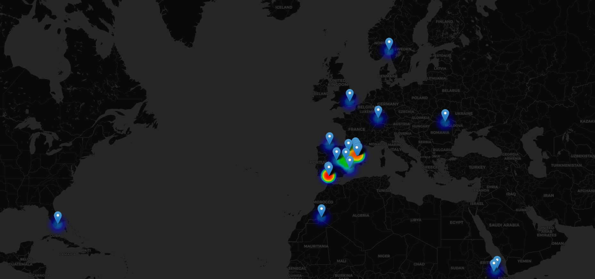

`Trackgram` Use Instagram location features to track an account



**Usage**
---

```
At this moment the usage of Trackgram is extremly simple:

1. Download this repository

2. Go through the instalation steps

3. Change the parameters in the tracgram main method directly:
    + Mandatory:
        - NICKNAME: your username on Instagram
        - PASSWORD: your instagram password
        - OBJECTIVE: your objective username

    + Optional:
        - path_to_csv: the path were the csv file will be stored, including the name


4. Execute it with python3 tracgram.py

```

**Installation steps**
---

1. Download with `$ git clone https://github.com/initzerCreations/Tracgram`

2. Install dependencies using `pip install -r requirements.txt`

3. Congrats! by now you should be able to run it:
    `python3 tracgram.py`

**Screenshots**


**Features**
---

1. Provides a heatmap based on the location frequency

2. Markers displayed on the heatmap indicating:
    - Exact location name
    - Time when relate post was made
    - Link to Google Maps address

3. Graph relating the posts count for an specific location

4. Generate a easy to process .CSV file